# Lab01 - MongoDB

---

## 1. Mục tiêu bài thực hành

- Làm quen với MongoDB Atlas và MongoDB Compass.
- Thực hiện các thao tác CRUD cơ bản và Aggregation.

---

## 2. Nội dung bài làm

### 2.1

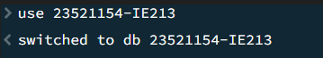

### 2.2

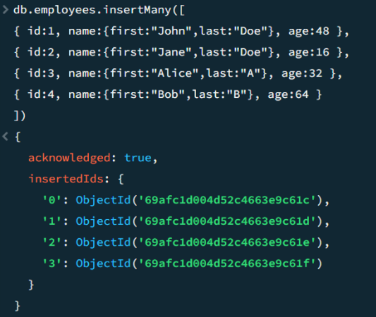

### 2.3

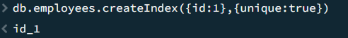

### 2.4

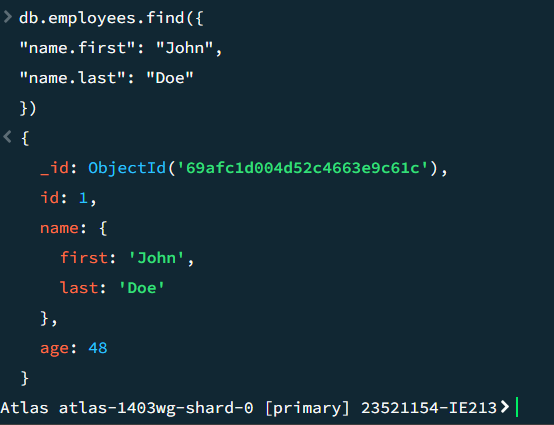

### 2.5

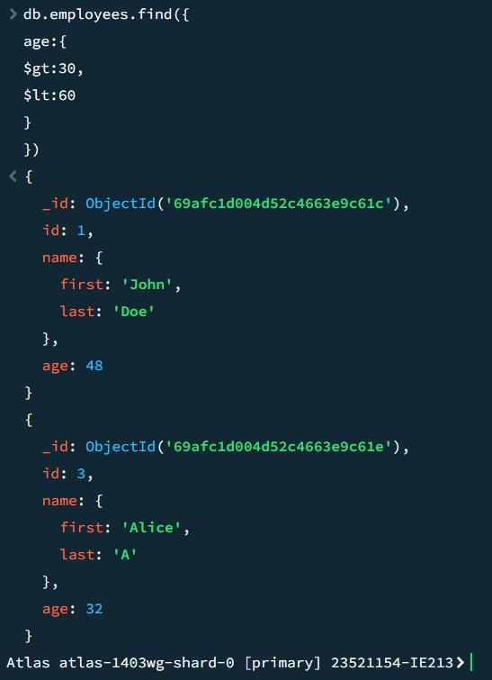

### 2.6

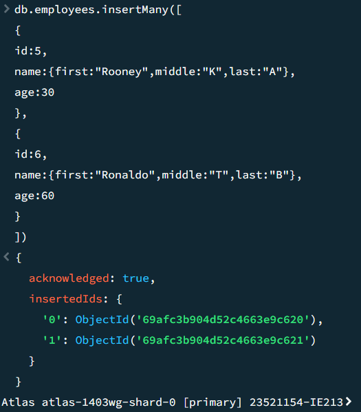
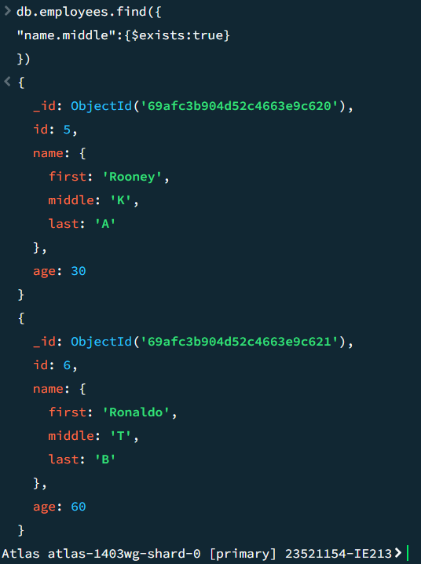

### 2.7

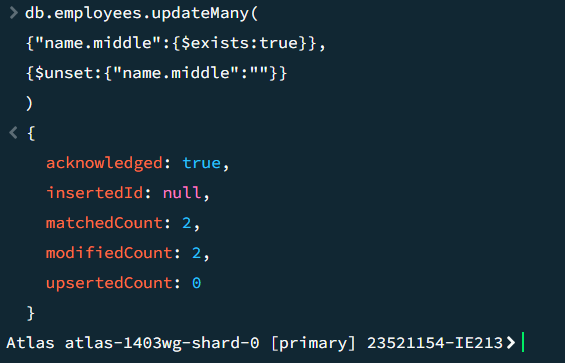

### 2.8

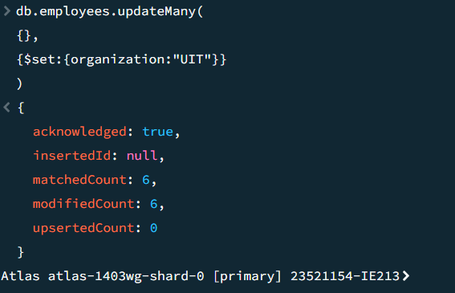

### 2.9

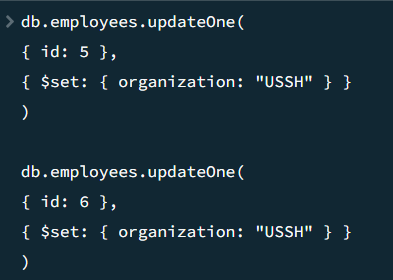

### 2.10

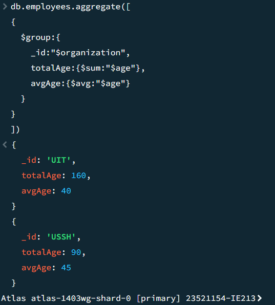
