# Lab02 - NodeJS & Express API

---

## 1. Mục tiêu bài thực hành

- Làm quen với Expressjs và Nodejs.
- Thực hiện code backend cơ bản.

---

## 2. Nội dung bài làm

### 2.1. Kiểm tra môi trường Node.js

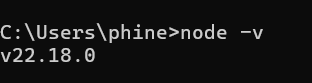

### 2.2. Cài đặt VS Code

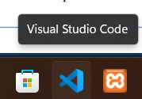

### 2.3. Tạo cây thư mục

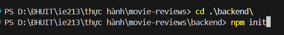

### 2.4. Init dự án

### 2.5. Cài đặt các dependency

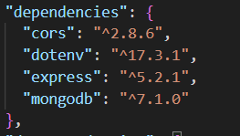

### 2.6. Cài đặt nodemon

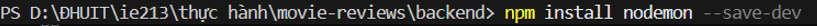
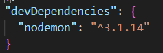

### 2.7. Code server.js

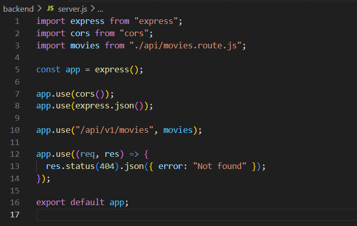

### 2.8. Thêm file .env

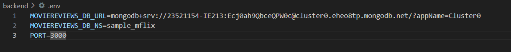

### 2.9. Code index.js

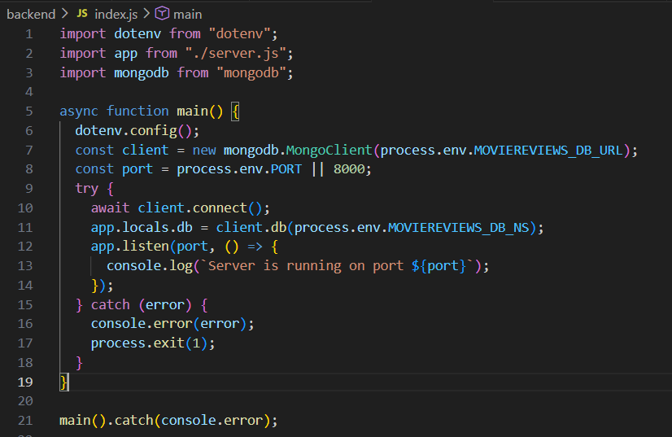

### 2.10. Code movies.route.js

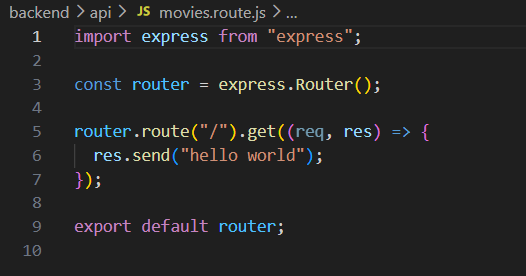

### 2.11. Tạo và code file movieDao và bổ sung vào index.js

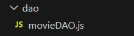
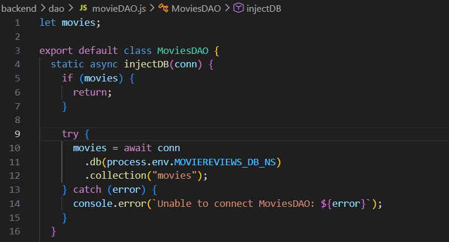
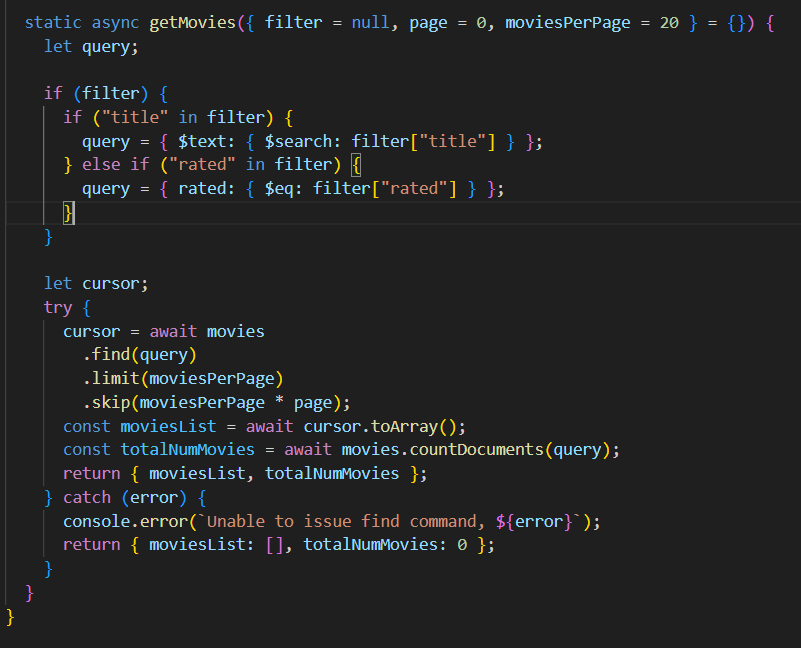
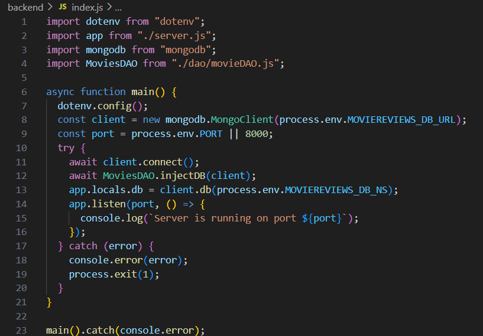

### 2.12. Tạo và code file movieController

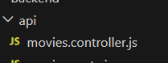
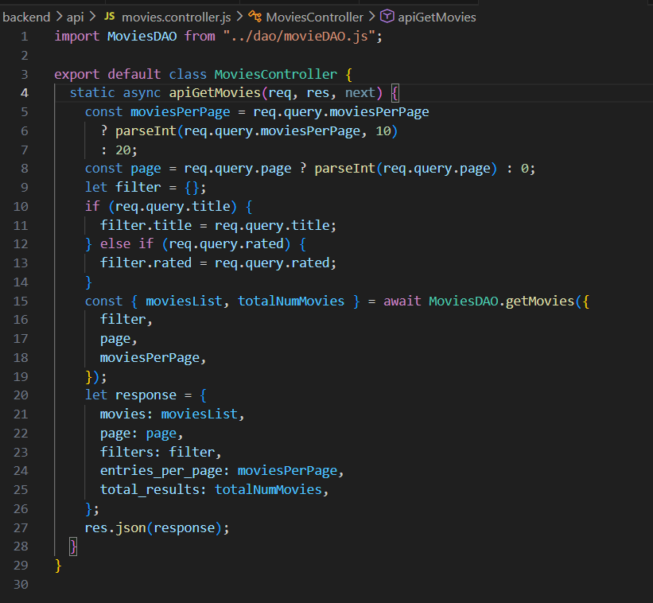

### 2.13. Test api

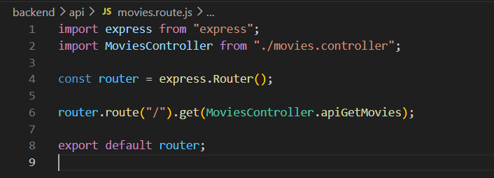
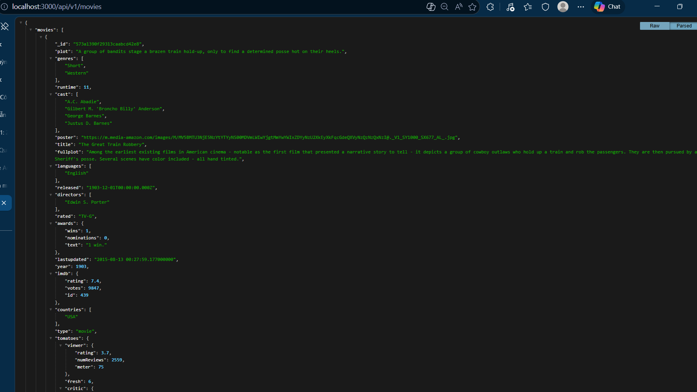
