# Lab03 - Hoàn thiện backend cho ứng dụng minh họa

## 1. Mục tiêu bài thực hành

- Viết các api cho review
- Bổ sung 2 api lấy rating và thông tin có liên quan movie

---

## 2. Nội dung bài làm

### 2.1. Thiết lập định tuyến cho các thao tác với review

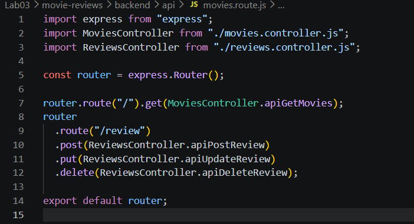

### 2.2. Tạo file reviews.controller.js

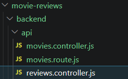

### 2.3. import nội dung từ reviewDao.js

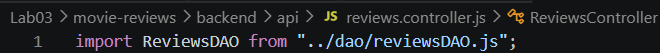

### 2.4. Tạo phương thức apiPostReview()

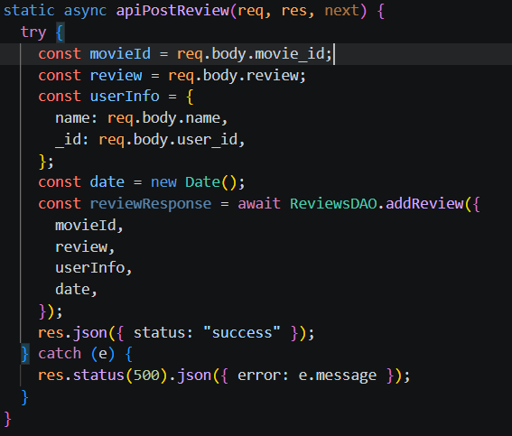

### 2.5. Tạo phương thức apiUpdateReview()

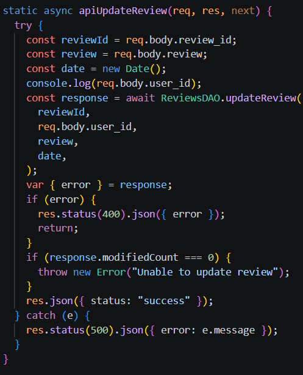

### 2.6. Tạo phương thức apiDeleteReview()

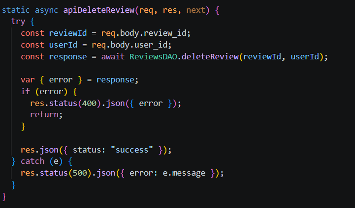

### 2.7. Tạo tệp tin reviewDao.js

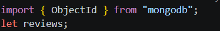

### 2.8. Tạo phương thức injectDB() và gọi trong tệp tin index.js

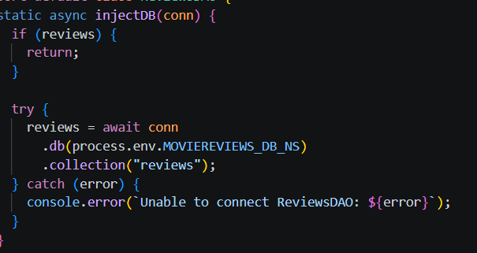
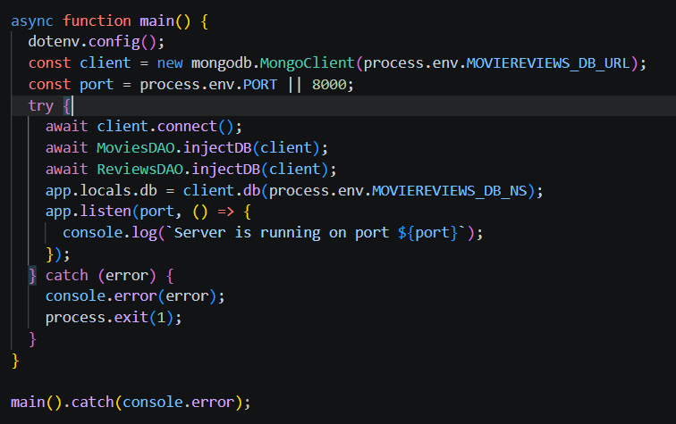

### 2.9. Tạo phương thức addReview()

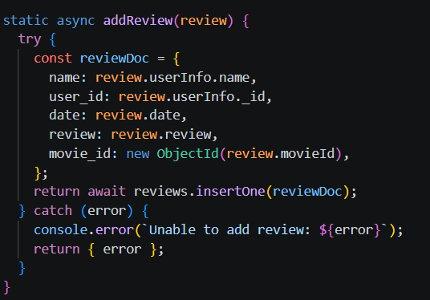

### 2.10. Tạo phương thức updateReview()

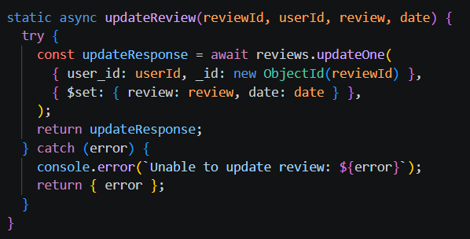

### 2.11. Tạo phương thức deleteReview()

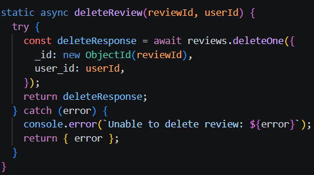

### 2.12. Test các API thêm/sửa/xóa review

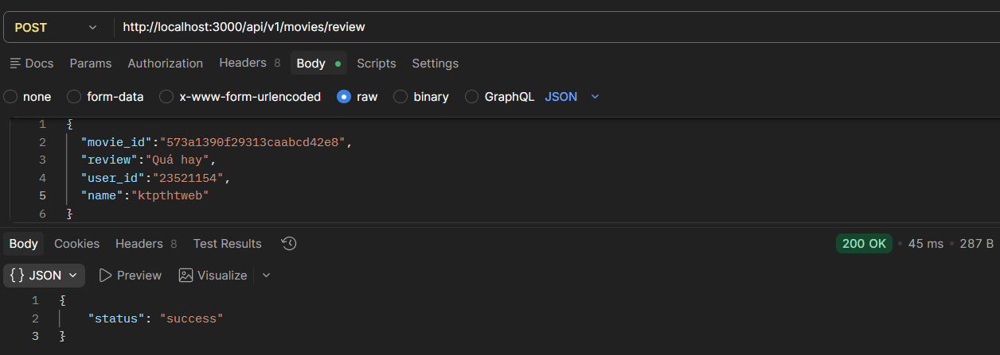
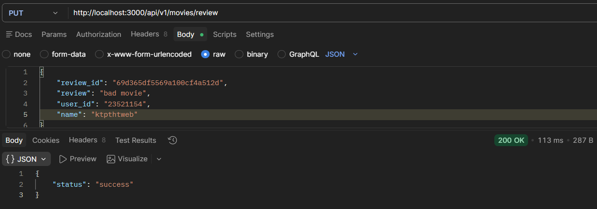
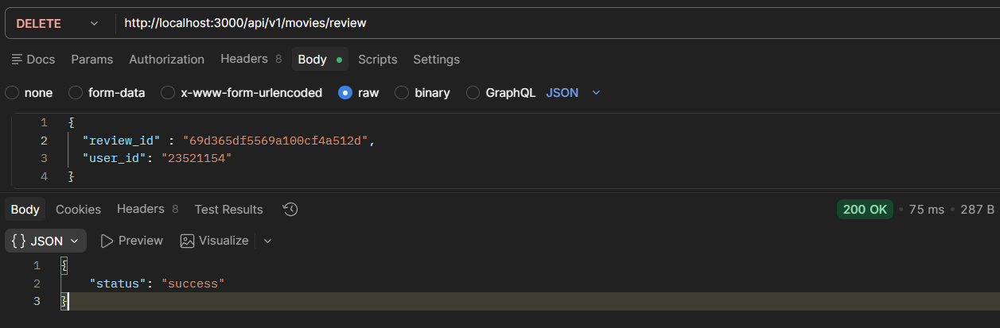

### 2.13. Thêm 2 định tuyến cho movie

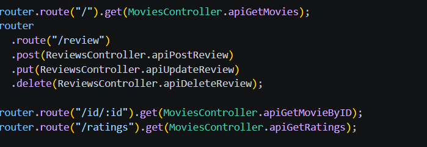

### 2.14. Thêm 2 phương thức apiGetMovieByID() và apiGetRatings() trong MovieController

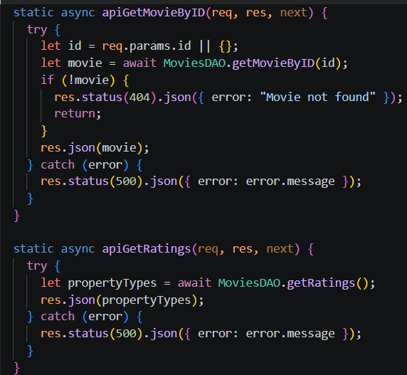

### 2.15. Thêm 2 phương thức getRatings() và getMovieById() trong MovieDao

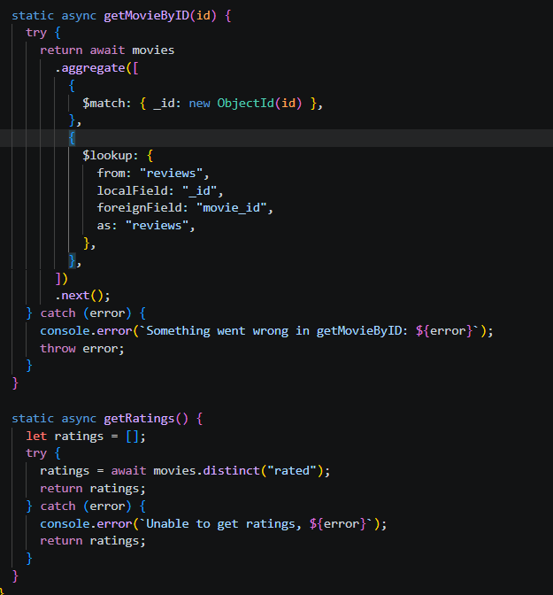

### 2.16. Thử nghiệm 2 api vừa viết cho movie

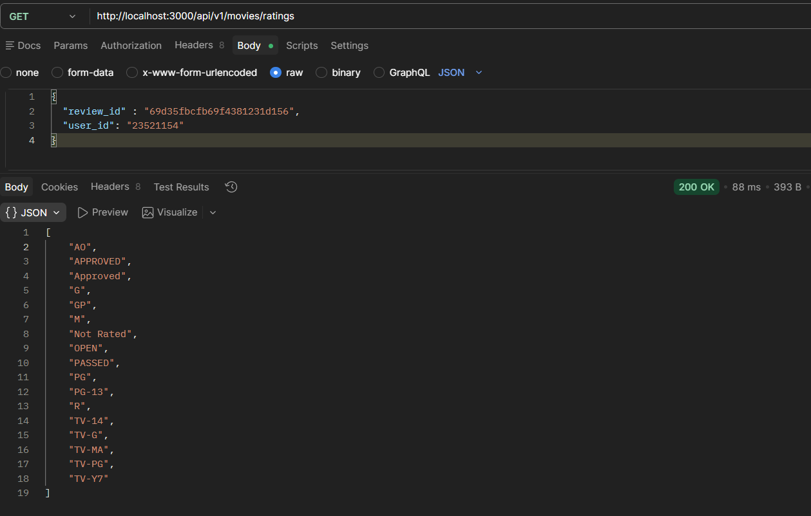
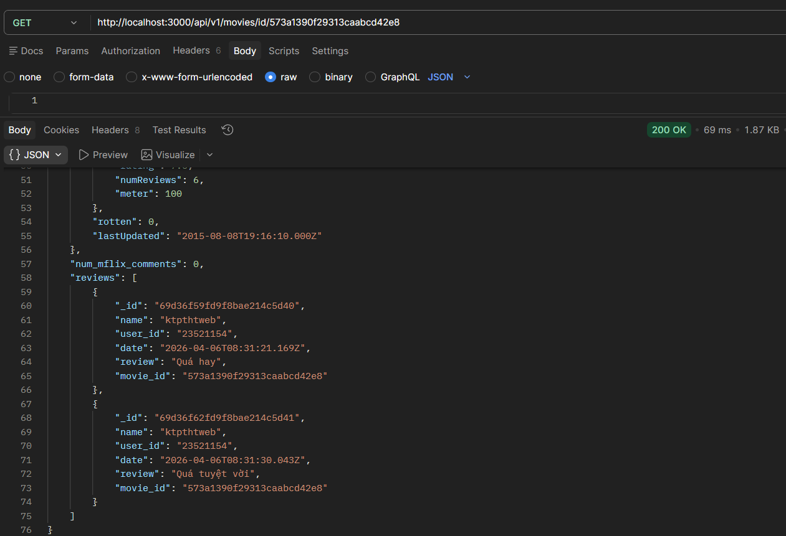
