# Lab04 - Thiết Lập Frontend Với REACTJS

## 1. Mục tiêu bài thực hành

- Thiết lập nơi làm việc với frontend của dự án.
- Xây dựng Navigation Header bar cho ứng dụng.
- Thiết lập các định tuyến cho các component.

---

## 2. Nội dung bài làm

### 2.1. Tạo template frontend với react

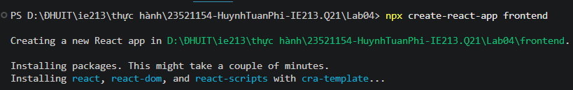

---

### 2.2. install Bootstrap

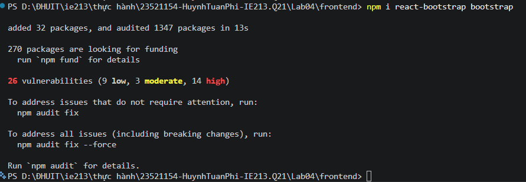

---

### 2.3. install react-router-dom

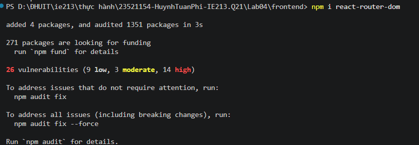

---

### 2.4. Xây dựng các component

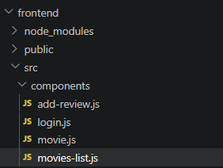

---

### 2.5. Lấy code Navbar từ Bootstrap và đưa vào App.js

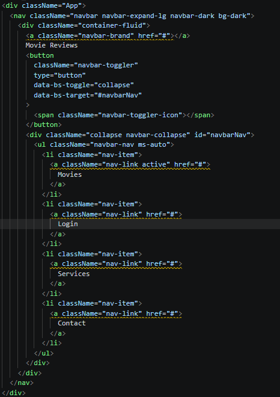

---

### 2.6. Chỉnh sửa thông tin phù hợp

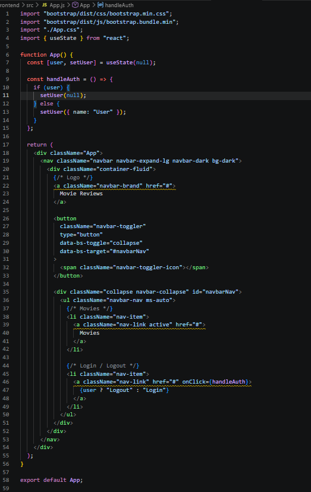

---

### 2.7. Giao diện login

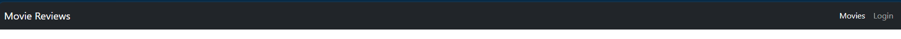

---

### 2.8. Giao diện logout

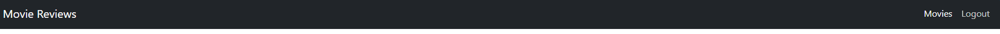

---

### 2.9. Sử dụng Routes

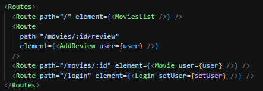

---

### 2.10. Thiết lập định tuyến

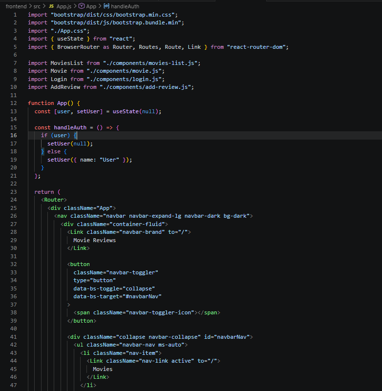  
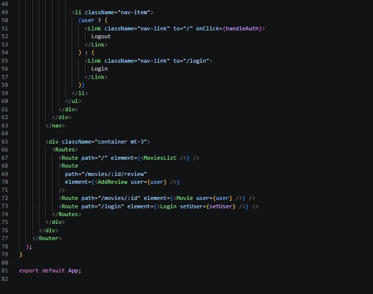
