# Lab05 - Xây Dựng Frontend Với ReactJS

## 1. Mục tiêu bài thực hành

- Kết nối frontend với backend bằng `axios`.
- Xây dựng danh sách phim có tìm kiếm theo `title` và `rating`.
- Hiển thị chi tiết phim, danh sách review và chức năng thêm/sửa/xóa review.
- Thiết lập định tuyến bằng `react-router-dom`.

---

## 2. Nội dung bài làm

### 2.1. Cài đặt `axios`

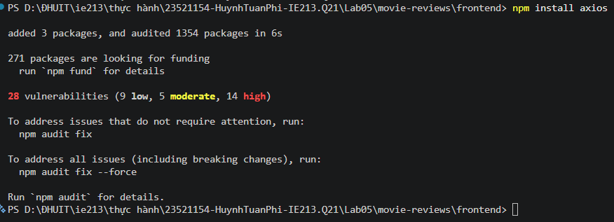

---

### 2.2. Tạo service `MovieDataService`

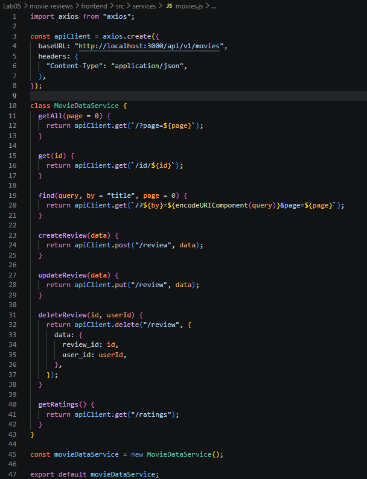

---

### 2.3. Xây dựng `MoviesList` component

#### 2.3.1. Tạo các biến trạng thái

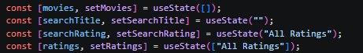

#### 2.3.2. Tạo `retrieveMovies()` và `retrieveRatings()`

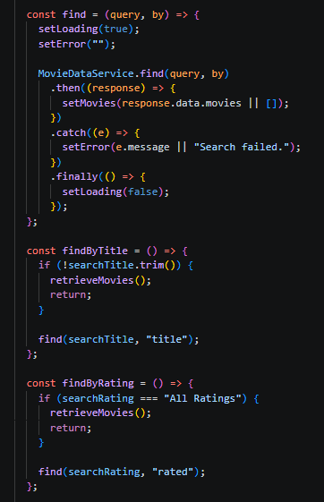

#### 2.3.3. Tạo form tìm kiếm theo `title` và `rating`

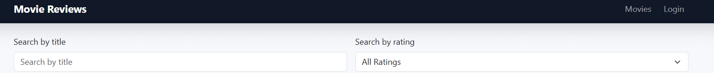

#### 2.3.4. Hiển thị movie bằng `Card`

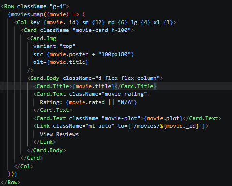

#### 2.3.5. Giao diện `MoviesList` hoàn chỉnh

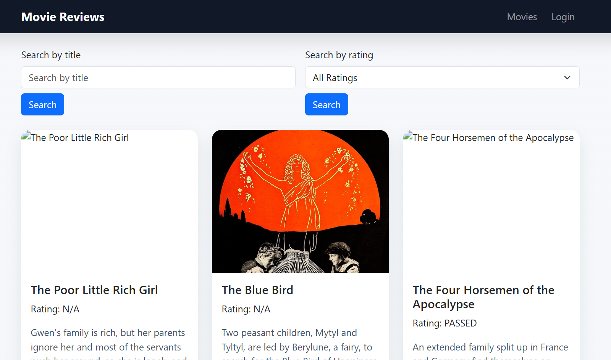

---

### 2.4. Xây dựng component `Movie`

#### 2.4.1. Thiết lập component `Movie`

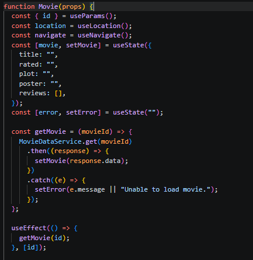

#### 2.4.2. Tạo phương thức `getMovie()`

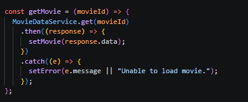

#### 2.4.3. Hiển thị trang chi tiết movie

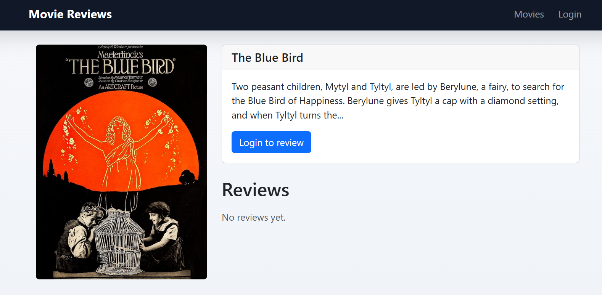  
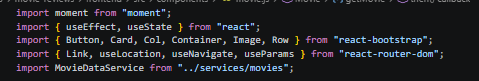

#### 2.4.4. Hiển thị danh sách review

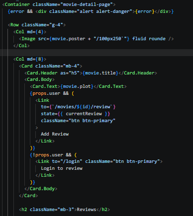  
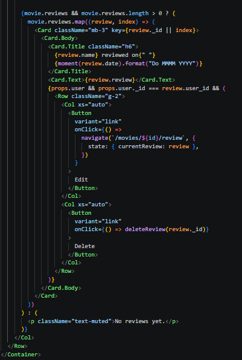

---

### 2.5. Hiển thị review và thao tác thêm/sửa/xóa

#### 2.5.1. Hiển thị danh sách review

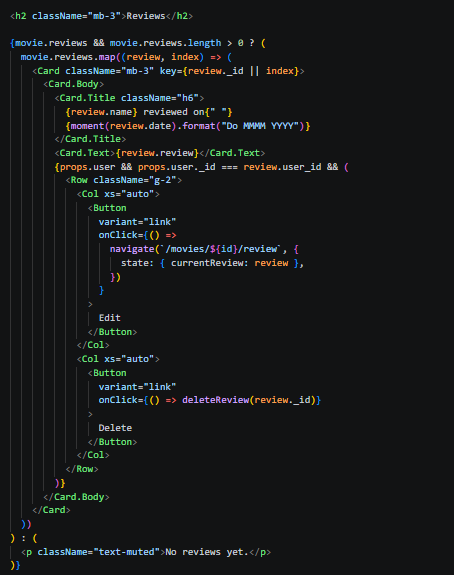

#### 2.5.2. Điều chỉnh hiển thị thời gian bằng `momentjs`

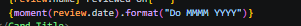  
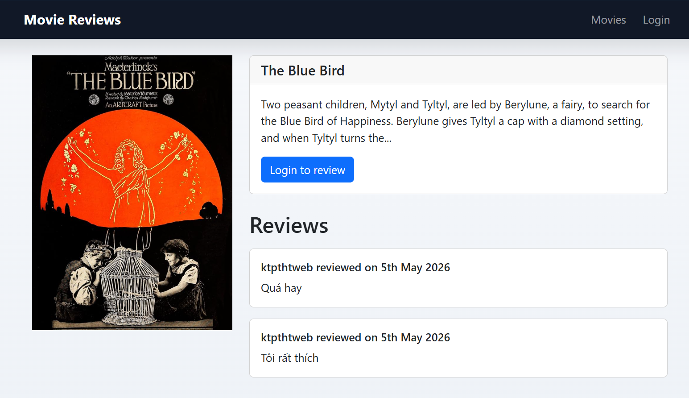
