# Lab06 - Xây Dựng Frontend Với ReactJS

## Câu 1

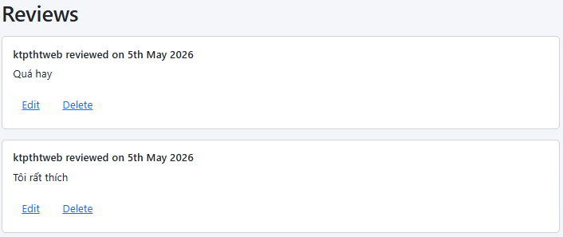

Ảnh mô tả câu 1.

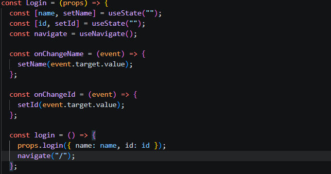

Ảnh mô tả câu 1.

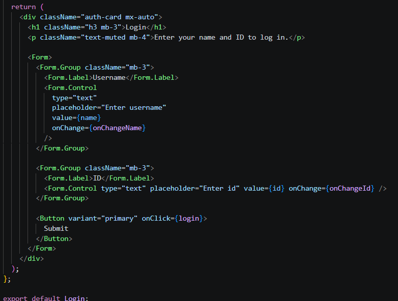

Ảnh mô tả câu 1.

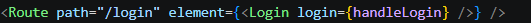

Ảnh mô tả câu 1.

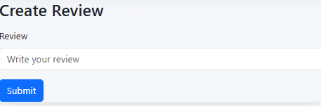

Ảnh mô tả câu 1.

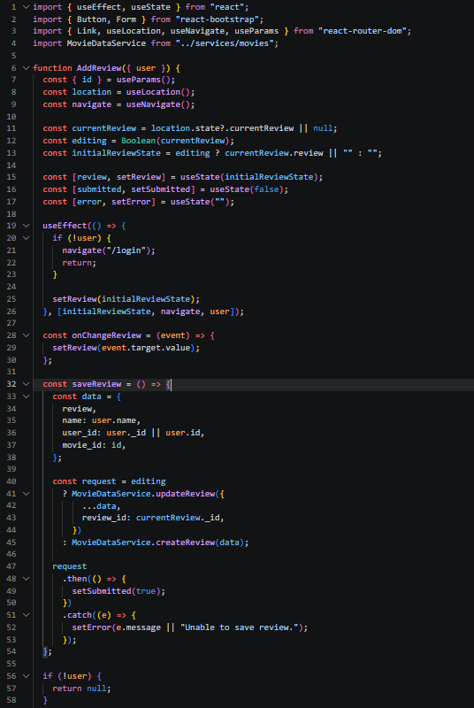

Ảnh mô tả câu 1.

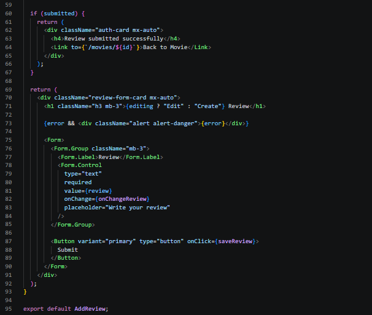

Ảnh mô tả câu 1.

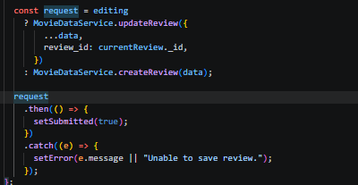

Ảnh mô tả câu 1.

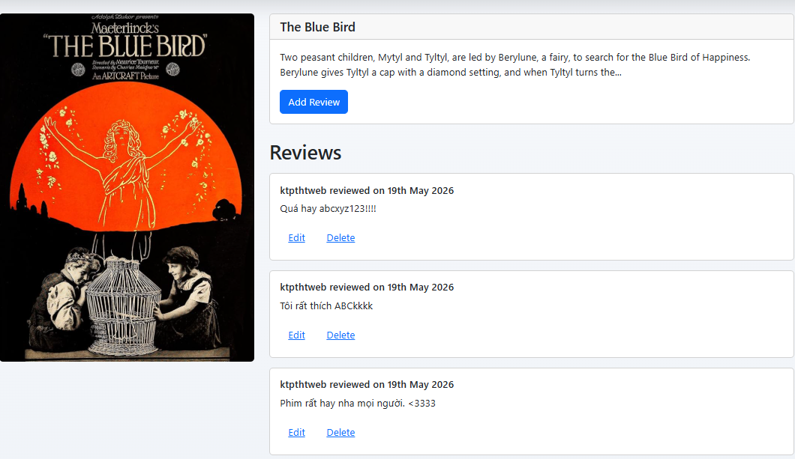

Ảnh mô tả câu 1.

## Câu 2

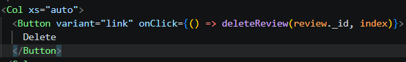

Ảnh mô tả câu 2.

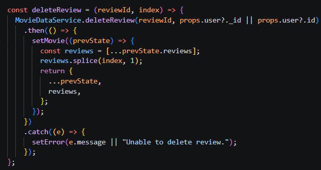

Ảnh mô tả câu 2.

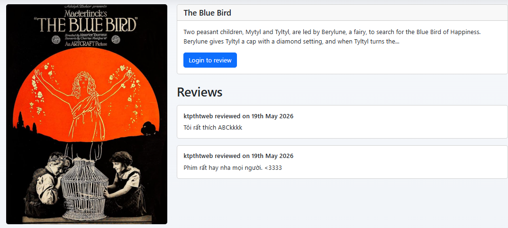

Ảnh mô tả câu 2.

## Câu 3

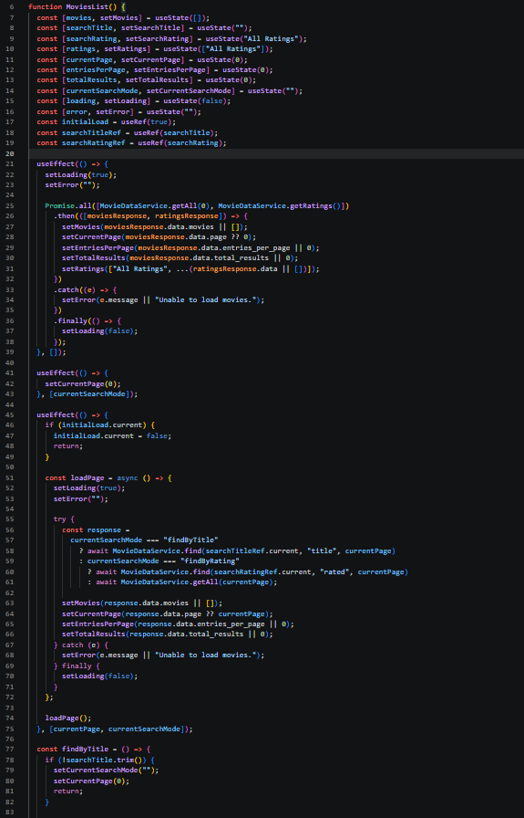

Ảnh mô tả câu 3.

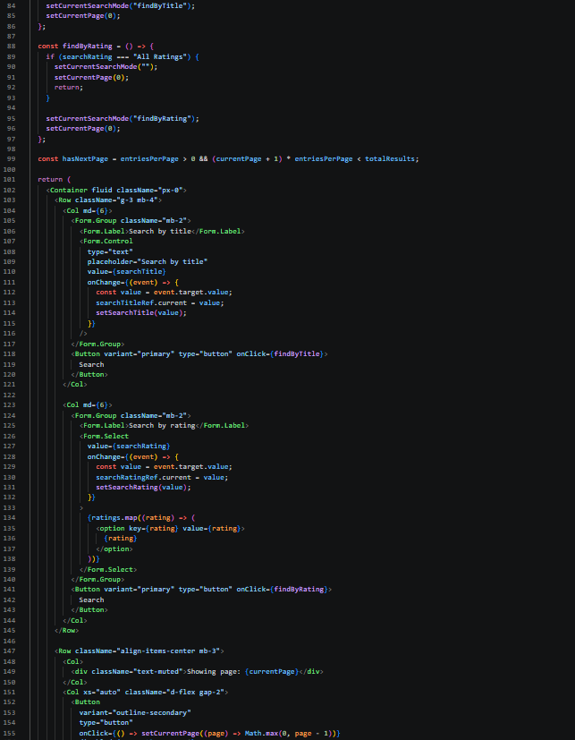

Ảnh mô tả câu 3.

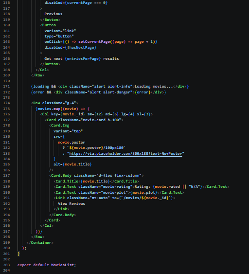

Ảnh mô tả câu 3.

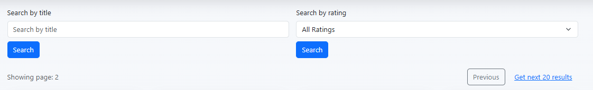

Ảnh mô tả câu 3.
